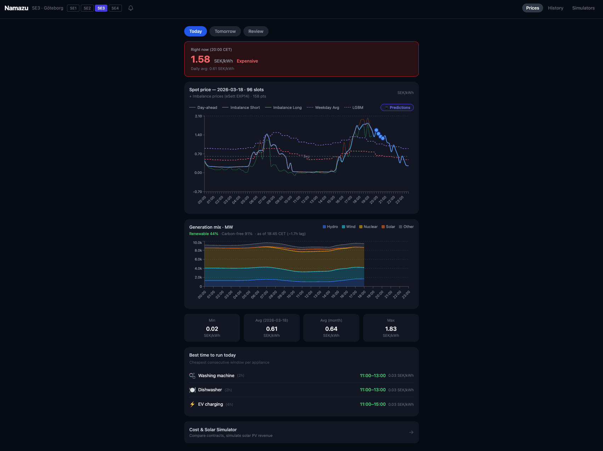

# Unagi — Swedish Electricity Price Dashboard

> *Unagi (うなぎ) = eel → el (Swedish for electricity) → .net (fishing net / network). A quadruple wordplay that powers this dashboard.*

**[Live demo → unagieel.net](https://unagieel.net)** &nbsp;|&nbsp; 142 tests &nbsp;|&nbsp; 0 SEK/month

A real-time dashboard for Swedish electricity spot prices with ML forecasting, built to answer one practical question: *when should you run your dishwasher?*



---

## Features

- **Spot prices** — 15-min slots from ENTSO-E with cheapest-window recommendations (washing, EV charging)
- **ML forecast** — LightGBM 24h prediction (37 features, Optuna-tuned, 46% MAE improvement over baseline)
- **Energy analytics** — generation mix, renewable %, multi-zone comparison (SE1–SE4)
- **Simulators** — fixed vs dynamic cost, solar PV revenue, battery dispatch optimization
- **Notifications** — daily Telegram alerts + browser push (VAPID)
- **Monitoring** — CloudWatch → SNS → Lambda → Telegram failure alerting

## Quick start

```bash
git clone git@github.com:mugime-shi/Unagi.git && cd Unagi
docker compose up                                  # API on :8100, PostgreSQL on :5533
cd frontend && npm install && npm run dev          # React on :5173
```

Add a free [ENTSO-E API key](https://transparency.entsoe.eu/) to `backend/.env` to fetch real prices.

## Tech stack

| Layer | Technology | Why |
|---|---|---|
| Backend | Python 3.12, FastAPI | Auto-docs, Pydantic validation, async-ready |
| Runtime | AWS Lambda (arm64 Docker) | Zero cost at this scale; same image local and prod |
| ASGI adapter | Mangum | Lambda integration without modifying app code |
| Database | PostgreSQL on Supabase | Full SQL, free tier with no expiry |
| ML | LightGBM + Optuna | Tabular-optimized; fits Lambda memory/time constraints |
| Frontend | React 19, Vite, Tailwind CSS | Fast iteration; Recharts for time-series |
| Hosting | Vercel | Free, auto-deploy on push |
| IaC | Terraform | Declarative, reproducible infrastructure |
| CI/CD | GitHub Actions | pytest → build → deploy → smoke test on every push |
| Monitoring | CloudWatch → SNS → Lambda → Telegram | Zero-cost automated failure alerting |

## Documentation

- **[System Design](docs/SYSTEM_DESIGN.md)** — architecture, design decisions, infrastructure, cost analysis, ML details
- **[API Reference](docs/API.md)** — 22 endpoints across 5 routers

## Contact

mugimeishi@gmail.com
